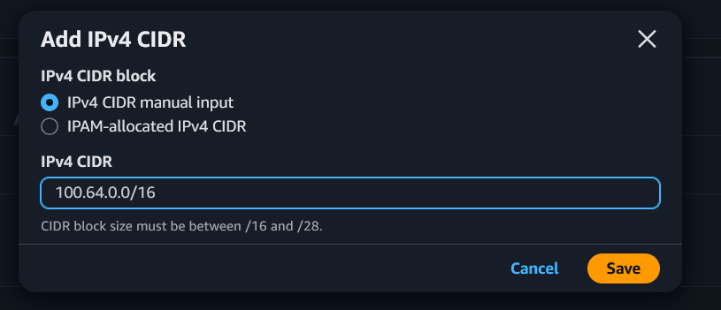

# Solving AWS Subnet IP Exhaustion with a CGNAT Overlay Network

We've all been there. You get handed a VPC with a `/24` by the networking team and somehow you're supposed to fit 200 microservices into it. Because of course you are. 

Fast forward a few sprints, and now Pods won't schedule and subnets are jammed. You asked your Gen-AI/search engine for help, but all you got was a vague wall of AWS docs about “custom networking.” Useless. So let me cut through the fluff: **CGNAT overlay mode** is your way out.

It sticks your pods behind a NAT in a secondary CIDR block, freeing up your main subnets. Pods get IPs, nodes stay happy, and you don’t have to go begging for more VPC space like it’s cloud rationing season.

## Requirements

- Terraform
- AWS VPC / EKS

### Carrier-grade NAT ?

A [CGNAT overlay](https://docs.aws.amazon.com/eks/latest/best-practices/custom-networking.html) refers to assigning pod IPs from a secondary CIDR behind NAT, typically from the 100.64.0.0/10 range used by ISPs for large-scale private networking. This keeps your main subnets free and avoids IP exhaustion.

## VPC CIDR Config

We'll **add a secondary CIDR block** to an existing VPC to create an overlay network. This dedicated network range will host our Kubernetes pods.

### Portal

Search for VPC -> Select VPC -> Actions -> Edit CIDRs, then add a new IPv4 CIDR.



In our case, we cannot use the standard `100.64.0.0/10` range because we are restricted to using CIDR blocks between `/16` and `/28`, so we'll settle for `100.64.0.0/16`.

### Terraform

```hcl
resource "aws_vpc_ipv4_cidr_block_association" "cgnat_cidr" {
  vpc_id     = vpc-09796d57be9cec2d2
  cidr_block = "100.64.0.0/16"
}
```

## VPC Subnet Config

We'll need to create **an additional subnet** in **each availability zone where our Kubernetes cluster is running**. These subnets will host the CGNAT overlay network and provide the dedicated IP space for our pods.

Since EKS requires a minimum of 2 availability zones for cluster bootstrapping, you'll need to create at least 2 CGNAT subnets - one per availability zone.

### Portal

Navigate to VPC -> Subnets -> Create subnet. Select the new CIDR range and create 2 subnets, ensuring each is placed in the same availability zone as the existing subnets you'll link them to.

https://registry.terraform.io/providers/hashicorp/aws/latest/docs/resources/subnet

### Terraform

```hcl
resource "aws_subnet" "in_pods_eu_west_1b" {
  vpc_id     = aws_vpc_ipv4_cidr_block_association.cgnat_cidr.vpc_id
  cidr_block = "100.64.0.0/17"
  availability_zone = "eu-west-1b"

  tags = {
    Name = "Internal/pods-eu-west-1b"
  }
}

resource "aws_subnet" "in_pods_eu_west_1c" {
  vpc_id     = aws_vpc_ipv4_cidr_block_association.cgnat_cidr.vpc_id
  cidr_block = "100.64.128.0/17"
  availability_zone = "eu-west-1c"

  tags = {
    Name = "Internal/pods-eu-west-1c"
  }
}
```

## VPC Routing Config

To enable communication between the new overlay subnets and their corresponding subnets in the same availability zones, we need to configure routing.

#### Portal

**TODO**

#### Terraform

AWS automatically creates local routes for all CIDR blocks within the same VPC.

When we have multiple CIDR blocks in a VPC (like our 10.x.y.0/24 and 100.64.0.0/16), AWS automatically adds local routes to every route table in that VPC. These local routes enable communication between all subnets within the VPC, regardless of which CIDR block they belong to.

We can verify this by checking our route table in the AWS console - we'll see entries like:
```text
10.x.y.0/24 -> local
100.64.0.0/16 -> local
```

No additional routing configuration is needed for inter-VPC subnet communication

```hcl
# Create a route table for CGNAT subnets
resource "aws_route_table" "cgnat_route_table" {
  vpc_id = aws_vpc_ipv4_cidr_block_association.cgnat_cidr.vpc_id

  # Local route is automatically created by AWS for VPC CIDR blocks
  # This allows traffic between 100.64.0.0/16 and 10.x.y.0/24

  tags = {
    Name = "cgnat-route-table"
  }
}

# Associate the route table with the CGNAT subnets
resource "aws_route_table_association" "cgnat_rt_association_1b" {
  subnet_id      = aws_subnet.in_pods_eu_west_1b.id
  route_table_id = aws_route_table.cgnat_route_table.id
}

resource "aws_route_table_association" "cgnat_rt_association_1c" {
  subnet_id      = aws_subnet.in_pods_eu_west_1c.id
  route_table_id = aws_route_table.cgnat_route_table.id
}
```

## Security Groups Config

Security groups on AWS are placed on ENI (Elastic Network Interface) level.
We must create a security group for the CGNAT overlay network to allow traffic between the pods and the rest of the VPC.

### Portal

**TODO**

### Terraform

```hcl
# Create a security group for the CGNAT overlay network pods
resource "aws_security_group" "cgnat_overlay_sg" {
  name        = "cgnat-overlay-sg"
  description = "Security group for Carrier-Grade NAT overlay network pods"
  vpc_id      = aws_vpc_ipv4_cidr_block_association.cgnat_cidr.vpc_id

  tags = {
    Name = "cgnat-overlay-sg"
  }
}

# Allow all inbound traffic from VPC CIDR blocks
resource "aws_vpc_security_group_ingress_rule" "allow_vpc_traffic" {
  security_group_id = aws_security_group.cgnat_overlay_sg.id
  cidr_ipv4         = "10.196.24.0/24"  # Adjust to match main VPC CIDR
  ip_protocol       = "-1"
}

resource "aws_vpc_security_group_ingress_rule" "allow_cgnat_traffic" {
  security_group_id = aws_security_group.cgnat_overlay_sg.id
  cidr_ipv4         = "100.64.0.0/16" # Adjust to match CGNAT CIDR
  ip_protocol       = "-1"
}

# Allow all outbound traffic
# NOTE: This rule is auto created by AWS for all security groups, but you must recreate it because terraform will remove it.
resource "aws_vpc_security_group_egress_rule" "allow_all_outbound" {
  security_group_id = aws_security_group.cgnat_overlay_sg.id
  cidr_ipv4         = "0.0.0.0/0"
  ip_protocol       = "-1"
}
```

## Kubernetes configuration

Create an EKS cluster on the normal routable subnets, using the same availability zones where we created the CGNAT overlay subnets.

::: warning
This section is only for **managed** and **self-managed nodegroups**. In **auto mode** this feature is available via the [nodeClassObject](https://docs.aws.amazon.com/eks/latest/userguide/create-node-class.html#auto-node-class-spec) with some small differences.
:::

### aws-node daemonset configuration

We need to configure the `aws-node` daemonset to use the CGNAT overlay network. This is done by setting some environment variables in the daemonset.

````shell
kubectl set env daemonset aws-node -n kube-system AWS_VPC_K8S_CNI_CUSTOM_NETWORK_CFG=true
````

This enables custom networking mode . When set to `true`, the CNI will use separate subnets for pod networking instead of the node's subnet. This is the master switch that tells the CNI to look for ENIConfig resources rather than using default behavior where pods share the same subnet as their nodes.

````shell
kubectl set env daemonset aws-node -n kube-system ENI_CONFIG_LABEL_DEF=topology.kubernetes.io/zone
````

This tells the CNI which node label to use when selecting the appropriate ENIConfig resource. The CNI will look at each node's `topology.kubernetes.io/zone` label value and find an ENIConfig resource whose name matches that zone. 

### ENI Configuration

We need to configure the Elastic Network Interface attached to our nodes to use the newly created subnets. Again one for each subnet.

````yaml
apiVersion: crd.k8s.amazonaws.com/v1alpha1
kind: ENIConfig
metadata:
  name: eu-west-1c
spec:
  subnet: subnet-xxxxxxxxxxxxxxxx
  securityGroups: [sg-xxxxxxxxxxxxxxxx]
---
apiVersion: crd.k8s.amazonaws.com/v1alpha1
kind: ENIConfig
metadata:
  name: eu-west-1b
spec:
  subnet: subnet-xxxxxxxxxxxxxxxx
  securityGroups: [sg-xxxxxxxxxxxxxxxx]
````

the spec requires the following:
- **``subnet``** the subnet ID of the CGNAT overlay subnets created in the previous step. Be sure to use the correct subnet ID for each availability zone.
- **`securityGroups`** the security group ID of the CGNAT overlay security group created in the previous step. This security group will allow traffic between the pods and the rest of the VPC.

## References

- [CGNAT Overlay Network in AWS](https://docs.aws.amazon.com/eks/latest/best-practices/custom-networking.html) - Official AWS documentation on setting up a CGNAT overlay network.
- [Customize the secondary network interface in Amazon EKS nodes](https://docs.aws.amazon.com/eks/latest/userguide/cni-custom-network-tutorial.html) - Tutorial on customizing the secondary network interface in Amazon EKS nodes.
- [ENIConfig method](https://docs.aws.amazon.com/eks/latest/userguide/cni-custom-network-tutorial.html#custom-networking-configure-kubernetes) - This is only supported on managedNodeGroups and selfManagedNodeGroups, not on auto mode.
- [Amazon Documentation Updates](https://docs.aws.amazon.com/eks/latest/userguide/doc-history.html) - A full list of all changes to the docs, create way to check for new features.
- [NodeClass CRD Spec](https://docs.aws.amazon.com/eks/latest/userguide/create-node-class.html#auto-node-class-spec) - Official reference for the CRD Object.
- [YouTube video](https://www.youtube.com/watch?v=ICgj71wmN6E) - A video that provides a comprehensive overview of the process.


